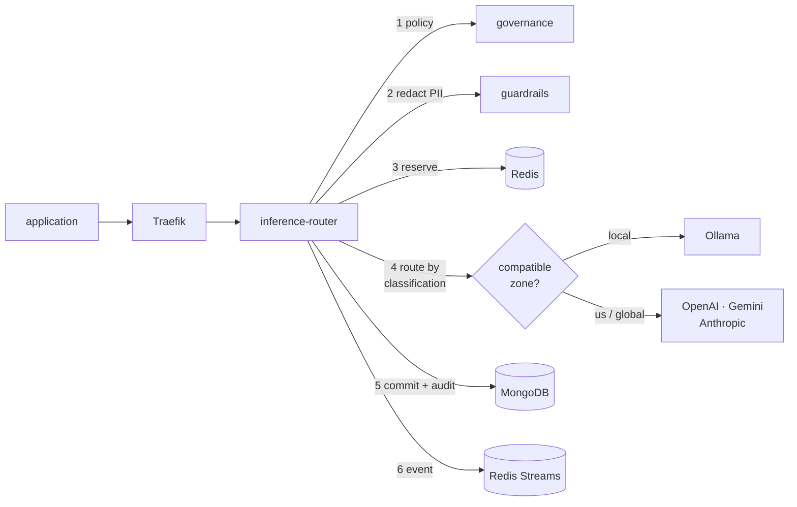

# AIA Platform

An enterprise AI platform, **open source and cloud-agnostic**. One entry point
for every model, with budget, governance, audit and the guarantee that sensitive
data never leaves your machine.

The whole thing comes up with `docker compose`. **No cloud account and no paid
API key** — local models run through Ollama, at zero cost.

```bash
make bootstrap && make dev && make models && make seed
```

---

## The problem it solves

When each application calls the model provider directly, three things become
impossible: knowing how much was spent and where, swapping models without
touching N applications, and proving where each piece of data was processed.

The platform solves that with a single inference entry point:

|                                        |                                                                                                                                                       |
| -------------------------------------- | ----------------------------------------------------------------------------------------------------------------------------------------------------- |
| **One API for every provider**         | OpenAI-compatible. The application picks an _alias_ (`chat-fast`), never a provider. Swapping OpenAI for Gemini means editing the catalogue.          |
| **Budget in currency, not in tokens**  | Reserve before the call, commit the real cost afterwards, with atomic Lua scripts in Redis. Concurrent calls do not spend the same balance twice.     |
| **Sensitive data does not leave here** | A `restricted` project is served by the local model, even when asking for an alias that has OpenAI and Gemini. The external provider is never called. |
| **PII redacted before it leaves**      | CPF, CNPJ, card and bank account are detected with check-digit validation and replaced before any external call or persistence.                       |
| **Audit that stands as evidence**      | Every call records who, which project, which model and **in which data zone** it was processed.                                                       |

## Getting started

**You need**: Docker, Node 22 and Python 3.12. Nothing else.

```bash
git clone https://github.com/sauloleite/AIPlataform && cd AIPlataform

make bootstrap    # installs pnpm, uv and the dependencies
make dev          # brings the platform up (Docker has to be running)
make models       # pulls the local model (~1.3 GB, once)
make seed         # creates a sample project with a budget
```

`make seed` prints a token and a `project_id`. With those:

```bash
curl -N -X POST http://localhost:8080/v1/chat/completions \
  -H "Authorization: Bearer $AIA_TOKEN" \
  -H "X-Project-Id: $AIA_PROJECT" \
  -H 'Content-Type: application/json' \
  -d '{"model":"chat-local","messages":[{"role":"user","content":"hello"}],"stream":true}'
```

| Where                           | What                                                        |
| ------------------------------- | ----------------------------------------------------------- |
| http://localhost:8080           | The platform API                                            |
| http://localhost:3000           | Grafana — traces with `gen_ai.*` live under Explore → Tempo |
| http://localhost:9001           | MinIO                                                       |
| http://localhost:6333/dashboard | Qdrant                                                      |

To use paid providers, fill the keys into `.env` and restart. **A missing key
only disables that provider**; the platform keeps working.

```bash
OPENAI_API_KEY=sk-...
GEMINI_API_KEY=...
ANTHROPIC_API_KEY=sk-ant-...
```

## How a request works



1. **Project policy**: data classification, budget and limits. Cached locally
   with a short TTL — if governance goes down, the last policy applies and the
   response is flagged `policy_stale`.
2. **Guardrails**: PII redacted before any external call. Strong prompt injection
   is blocked.
3. **Budget reservation**: atomic, with a Lua script. With no balance left, `429`
   with `budget_exhausted` and `retry_after`.
4. **Routing**: only deployments whose data zone is compatible with the project's
   classification. It fails with `no_compatible_deployment` rather than sending
   anyway. If the first one fails, it falls through to the next, with a
   per-deployment circuit breaker.
5. **Commit of the real cost** and an audit record carrying the data zone.
6. **A `UsageRecorded` event** through the outbox — written in the same
   transaction as the audit record, published afterwards.

## Services

| Service                                                                                       | Stack   | State                                                     |
| --------------------------------------------------------------------------------------------- | ------- | --------------------------------------------------------- |
| `aia-inference-router`                                                                        | NestJS  | **complete** — 4 providers, budget, SSE, audit            |
| `aia-identity`                                                                                | NestJS  | **complete** — RS256 JWT, JWKS, PAT, service credentials  |
| `aia-governance`                                                                              | NestJS  | **complete** — projects, budget, classification, policies |
| `aia-guardrails`                                                                              | FastAPI | **complete** — Brazilian PII, prompt injection            |
| `aia-agent-runtime`                                                                           | FastAPI | skeleton — LangGraph in phase 3                           |
| `aia-registry`                                                                                | NestJS  | skeleton — phase 2                                        |
| `aia-evaluation`                                                                              | FastAPI | skeleton — phase 2                                        |
| `aia-knowledge`, `aia-mcp-gateway`, `aia-document-processing`, `aia-data-platform`, `aia-web` | —       | phases 2 to 4                                             |

A new service is born in the right shape through the generator:

```bash
node tools/generators/new-service.mjs --name my-service --runtime node --port 3010
```

## Architecture

Clean Architecture per service, with the dependency rule **verified in CI**:

```
presentation/    controllers and SSE — they only adapt input and output
application/     use cases and ports (interfaces)
domain/          entities and pure rules — no framework, no I/O
infrastructure/  adapters that implement the ports
```

`make arch` fails if `domain/` imports from `infrastructure/`. CI goes further:
it **introduces a violation on purpose** and fails if the rule does not catch it
— an architecture test that never fails protects nothing.

Every piece of infrastructure sits behind a port, with an open source default
implementation ([ADR-012](docs/adr/ADR-012-cloud-independence.md)):

| Role              | Default               | Swappable for                |
| ----------------- | --------------------- | ---------------------------- |
| Documents         | MongoDB               | Atlas, DocumentDB, Cosmos DB |
| Cache and budget  | Redis                 | Valkey, ElastiCache          |
| Events and queues | Redis Streams, BullMQ | Kafka, RabbitMQ, SQS         |
| Objects           | MinIO                 | S3, GCS, Blob                |
| Vectors           | Qdrant                | pgvector, AI Search, Vertex  |
| Observability     | OTel → Grafana LGTM   | any OTLP backend             |

## Development

```bash
make check        # what CI runs: lint, types, architecture, tests
make test         # unit and integration
make e2e          # the full flow against the local environment
make lint-fix     # fixes what can be fixed automatically
make contracts    # regenerates the types from contracts/openapi
```

Contract-first: the YAML under `contracts/` is the source of truth, and CI fails
if the generated types differ from what was committed.

## Deployment

```bash
# Self-hosted (VPS, server, homelab)
docker compose -f deploy/compose/docker-compose.yml \
               -f deploy/compose/docker-compose.prod.yml up -d

# Kubernetes (k3s, kind, EKS, GKE, AKS)
helm install aia deploy/helm/aia-platform \
  --set mongodb.enabled=false --set mongodb.externalUri=mongodb://your-cluster
```

Before the production compose, generate the secrets: see
[deploy/compose/secrets/README.md](deploy/compose/secrets/README.md).

## Documentation

|                                |                                                                   |
| ------------------------------ | ----------------------------------------------------------------- |
| [ADRs](docs/adr/)              | The 15 architecture decisions, with alternatives and consequences |
| [Runbooks](docs/runbooks/)     | What to do when something goes wrong                              |
| [Checklists](docs/checklists/) | Sprint 0 and production readiness                                 |
| [Reference](docs/reference/)   | The original architecture documents this project came from        |

The reference documents design the platform on Azure, and are kept in their
original Portuguese as the unaltered source this work started from. This
implementation is cloud-agnostic; wherever the decisions diverge, the
corresponding ADR says what changed and why.

## Compliance

Built with regulation in mind (BACEN, LGPD), and the controls are structural, not
documentary:

- **Legal basis and purpose** are required when a project is created (LGPD art. 7).
- **PII redaction** before any content is persisted.
- **Data residency** is provable: the processing zone is on every audit record.
- **Retention** enforced by the database through TTL, not by a job someone can
  forget.
- **Data subject rights**: procedure in a
  [runbook](docs/runbooks/lgpd-data-subject-request.md).
- **OWASP Top 10 for LLM**: LLM01, LLM02, LLM06, LLM07 and LLM10 with explicit,
  tested controls.

## License

MIT. See [LICENSE](LICENSE).
