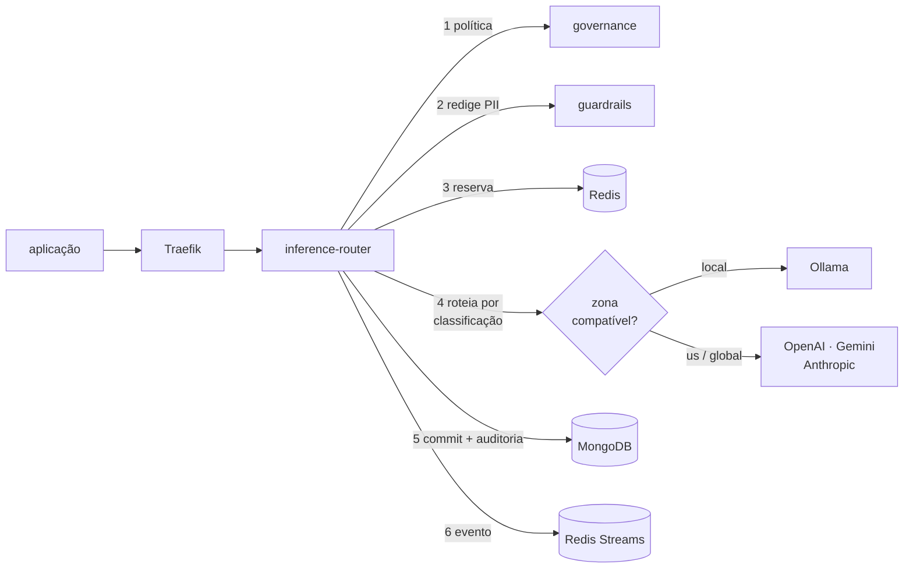

# AIA Platform

Plataforma corporativa de IA, **open source e agnóstica de cloud**. Um ponto de
entrada para todos os modelos, com orçamento, governança, auditoria e a garantia
de que dado sensível não sai da sua máquina.

Sobe inteira com `docker compose`. **Sem nenhuma conta de nuvem e sem nenhuma
chave de API paga** — os modelos locais rodam via Ollama, com custo zero.

```bash
make bootstrap && make dev && make models && make seed
```

---

## O problema que ela resolve

Quando cada aplicação chama o provedor de modelo direto, três coisas ficam
impossíveis: saber quanto se gastou e onde, trocar de modelo sem mexer em N
aplicações, e provar onde cada dado foi processado.

A plataforma resolve isso com um ponto único de inferência:

|                                       |                                                                                                                                                     |
| ------------------------------------- | --------------------------------------------------------------------------------------------------------------------------------------------------- |
| **Uma API para todos os provedores**  | Compatível com OpenAI. A aplicação escolhe um _alias_ (`chat-rapido`), nunca um provedor. Trocar OpenAI por Gemini é editar o catálogo.             |
| **Orçamento em moeda, não em tokens** | Reserva antes da chamada, commit do custo real depois, com scripts Lua atômicos no Redis. Chamadas simultâneas não gastam o mesmo saldo duas vezes. |
| **Dado sensível não sai daqui**       | Um projeto `restrito` é atendido pelo modelo local, mesmo pedindo um alias que tem OpenAI e Gemini. O provedor externo nem é chamado.               |
| **PII redigida antes de sair**        | CPF, CNPJ, cartão e conta são detectados com validação de dígito verificador e substituídos antes de qualquer chamada externa ou persistência.      |
| **Auditoria que serve de evidência**  | Cada chamada registra quem, qual projeto, qual modelo e **em que zona de dados** foi processada.                                                    |

## Começando

**Precisa de**: Docker, Node 22 e Python 3.12. Mais nada.

```bash
git clone https://github.com/sauloleite/AIPlataform && cd AIPlataform

make bootstrap    # instala pnpm, uv e as dependências
make dev          # sobe a plataforma (Docker precisa estar rodando)
make models       # baixa o modelo local (~1,3 GB, uma vez só)
make seed         # cria um projeto de exemplo com orçamento
```

O `make seed` imprime um token e um `project_id`. Com eles:

```bash
curl -N -X POST http://localhost:8080/v1/chat/completions \
  -H "Authorization: Bearer $AIA_TOKEN" \
  -H "X-Project-Id: $AIA_PROJECT" \
  -H 'Content-Type: application/json' \
  -d '{"model":"chat-local","messages":[{"role":"user","content":"ola"}],"stream":true}'
```

| Onde                            | O quê                                                       |
| ------------------------------- | ----------------------------------------------------------- |
| http://localhost:8080           | API da plataforma                                           |
| http://localhost:3000           | Grafana — os traces com `gen_ai.*` estão em Explore → Tempo |
| http://localhost:9001           | MinIO                                                       |
| http://localhost:6333/dashboard | Qdrant                                                      |

Para usar provedores pagos, preencha as chaves no `.env` e reinicie. **Chave
ausente apenas desabilita aquele provedor**; a plataforma continua funcionando.

```bash
OPENAI_API_KEY=sk-...
GEMINI_API_KEY=...
ANTHROPIC_API_KEY=sk-ant-...
```

## Como funciona uma requisição



1. **Política do projeto**: classificação de dados, orçamento e limites. Cache
   local com TTL curto — se o governance cair, a última política vale e a
   resposta é marcada com `policy_stale`.
2. **Guardrails**: PII redigida antes de qualquer chamada externa. Injeção de
   prompt forte é bloqueada.
3. **Reserva de orçamento**: atômica, com script Lua. Sem saldo, `429` com
   `budget_exhausted` e `retry_after`.
4. **Roteamento**: só deployments cuja zona de dados é compatível com a
   classificação do projeto. Falha com `no_compatible_deployment` em vez de
   enviar assim mesmo. Se o primeiro falhar, cai para o próximo, com circuit
   breaker por deployment.
5. **Commit do custo real** e auditoria com a zona de dados.
6. **Evento** `UsageRecorded` pela outbox — gravado na mesma transação que a
   auditoria, publicado depois.

## Serviços

| Serviço                                                                                       | Stack   | Estado                                                       |
| --------------------------------------------------------------------------------------------- | ------- | ------------------------------------------------------------ |
| `aia-inference-router`                                                                        | NestJS  | **completo** — 4 provedores, orçamento, SSE, auditoria       |
| `aia-identity`                                                                                | NestJS  | **completo** — JWT RS256, JWKS, PAT, credencial de serviço   |
| `aia-governance`                                                                              | NestJS  | **completo** — projetos, orçamento, classificação, políticas |
| `aia-guardrails`                                                                              | FastAPI | **completo** — PII brasileira, injeção de prompt             |
| `aia-agent-runtime`                                                                           | FastAPI | esqueleto — LangGraph na Fase 3                              |
| `aia-registry`                                                                                | NestJS  | esqueleto — Fase 2                                           |
| `aia-evaluation`                                                                              | FastAPI | esqueleto — Fase 2                                           |
| `aia-knowledge`, `aia-mcp-gateway`, `aia-document-processing`, `aia-data-platform`, `aia-web` | —       | Fases 2 a 4                                                  |

Serviço novo nasce no padrão certo pelo gerador:

```bash
node tools/generators/new-service.mjs --name meu-servico --runtime node --port 3010
```

## Arquitetura

Clean Architecture por serviço, com a regra de dependência **verificada no CI**:

```
presentation/    controllers e SSE — só adaptam entrada e saída
application/     casos de uso e ports (interfaces)
domain/          entidades e regras puras — sem framework, sem I/O
infrastructure/  adapters que implementam os ports
```

`make arch` reprova se `domain/` importar de `infrastructure/`. O CI vai além:
ele **introduz uma violação de propósito** e falha se a regra não pegar — um
teste de arquitetura que nunca reprova não protege nada.

Cada peça de infraestrutura está atrás de um port, com implementação padrão open
source ([ADR-012](docs/adr/ADR-012-independencia-de-cloud.md)):

| Papel             | Padrão                | Trocável por                 |
| ----------------- | --------------------- | ---------------------------- |
| Documentos        | MongoDB               | Atlas, DocumentDB, Cosmos DB |
| Cache e orçamento | Redis                 | Valkey, ElastiCache          |
| Eventos e filas   | Redis Streams, BullMQ | Kafka, RabbitMQ, SQS         |
| Objetos           | MinIO                 | S3, GCS, Blob                |
| Vetorial          | Qdrant                | pgvector, AI Search, Vertex  |
| Observabilidade   | OTel → Grafana LGTM   | qualquer backend OTLP        |

## Desenvolvimento

```bash
make check        # o que o CI roda: lint, tipos, arquitetura, testes
make test         # unitários e integração
make e2e          # fluxo completo contra o ambiente local
make lint-fix     # corrige o automático
make contracts    # regera os tipos a partir de contracts/openapi
```

Contract-first: o YAML em `contracts/` é a fonte da verdade, e o CI falha se os
tipos gerados divergirem do commitado.

## Implantação

```bash
# Self-host (VPS, servidor, homelab)
docker compose -f deploy/compose/docker-compose.yml \
               -f deploy/compose/docker-compose.prod.yml up -d

# Kubernetes (k3s, kind, EKS, GKE, AKS)
helm install aia deploy/helm/aia-platform \
  --set mongodb.enabled=false --set mongodb.externalUri=mongodb://seu-cluster
```

Antes do compose de produção, gere os segredos: veja
[deploy/compose/secrets/README.md](deploy/compose/secrets/README.md).

## Documentação

|                                |                                                                     |
| ------------------------------ | ------------------------------------------------------------------- |
| [ADRs](docs/adr/)              | As 15 decisões de arquitetura, com alternativas e consequências     |
| [Runbooks](docs/runbooks/)     | O que fazer quando algo dá errado                                   |
| [Checklists](docs/checklists/) | Sprint 0 e prontidão para produção                                  |
| [Referência](docs/reference/)  | Os documentos originais de arquitetura, que originaram este projeto |

Os documentos de referência desenham a plataforma sobre Azure. Esta
implementação é agnóstica de cloud; onde as decisões divergem, o ADR
correspondente diz o que mudou e por quê.

## Conformidade

Construída com regulação em mente (BACEN, LGPD), e os controles são estruturais,
não documentais:

- **Base legal e finalidade** obrigatórias no cadastro do projeto (LGPD art. 7).
- **Redação de PII** antes de qualquer persistência de conteúdo.
- **Residência de dados** provável: a zona de processamento está em cada registro
  de auditoria.
- **Retenção** aplicada pelo banco via TTL, não por job que alguém pode esquecer.
- **Direitos do titular**: procedimento em
  [runbook](docs/runbooks/pedido-de-titular-lgpd.md).
- **OWASP Top 10 for LLM**: LLM01, LLM02, LLM06, LLM07 e LLM10 com controles
  explícitos e testados.

## Licença

MIT. Veja [LICENSE](LICENSE).
