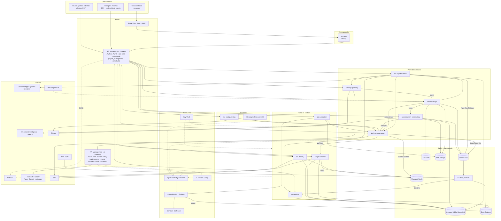
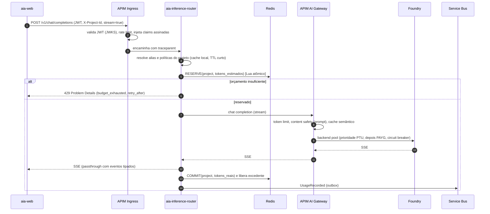
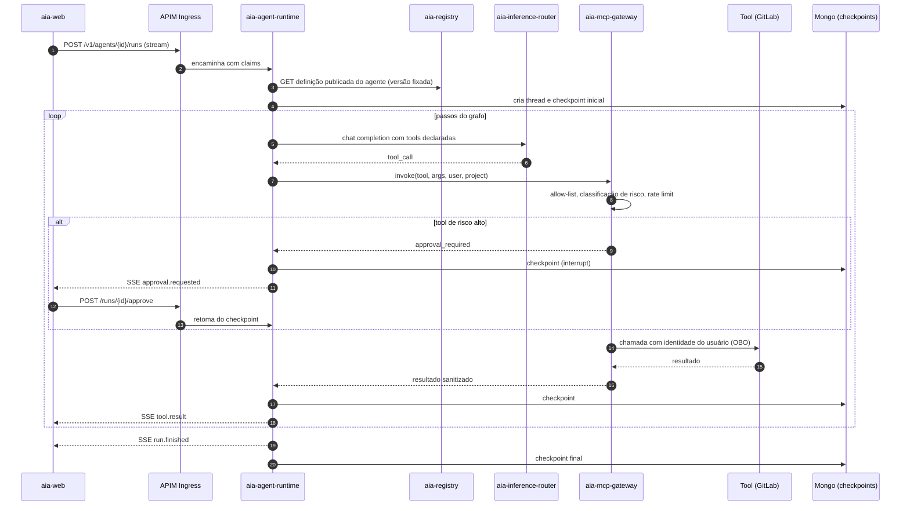
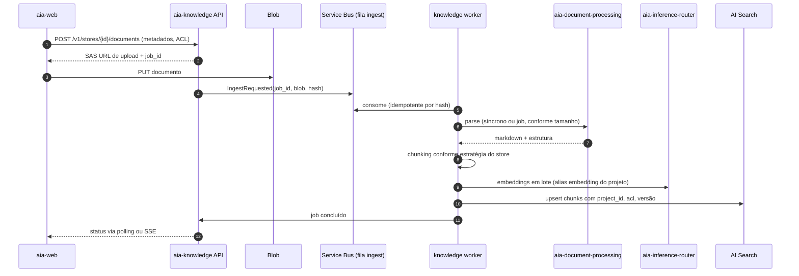
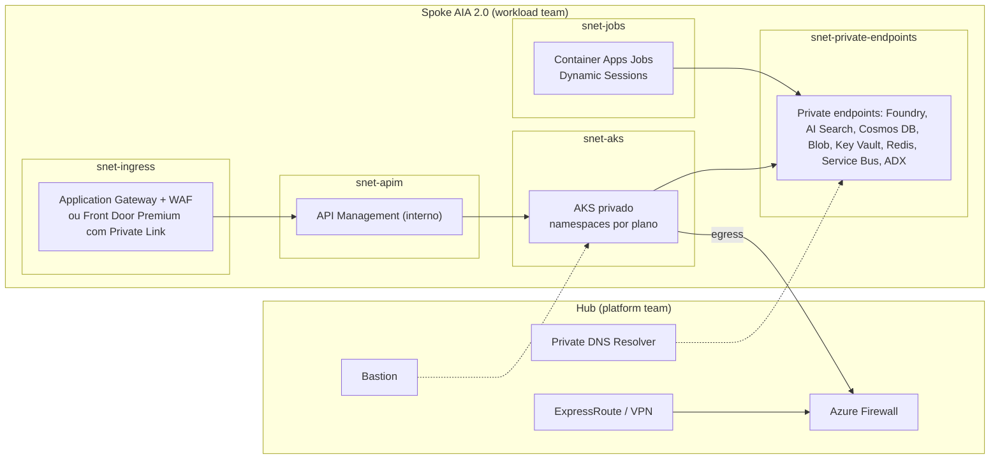

# 02. Arquitetura alvo: AIA 2.0

> Plataforma corporativa de IA para uma instituição financeira regulada, Azure como cloud primária, stack poliglota (NestJS + FastAPI). Este documento define a arquitetura alvo que resolve os achados do documento 01 e serve de base para o guia de implementação do documento 03.

## 1. Princípios de design

1. **Um ponto de entrada, um ponto de inferência.** Todo tráfego externo entra pelo API Management; toda chamada a modelo sai pelo `aia-inference-router` via AI Gateway. Nenhum serviço fala com o Foundry diretamente.
2. **Projeto é o tenant.** `project_id` é obrigatório em todo contrato, todo evento, todo trace, toda chave de partição e todo filtro de busca. Orçamento, políticas de modelo, classificação de dados e auditoria são funções do projeto.
3. **Cada serviço é dono de um contexto e de seus dados.** Nenhum serviço escreve no banco de outro. Integração por API síncrona (consulta) ou eventos (fatos consumados). Padrão outbox para publicar eventos com a mesma transação que altera o estado.
4. **Commodity no gateway, negócio no código.** Limite de tokens, balanceamento, circuit breaker, cache semântico e inspeção de conteúdo são políticas de API Management. Orçamento em moeda, políticas por classificação de dados, aliasing e auditoria bancária são código próprio.
5. **Identidade validada localmente.** JWT do Entra ID validado em cada serviço com JWKS em cache. Serviço a serviço via Managed Identity. Token opaco (PAT) só quando o cliente não suporta OAuth, com introspecção cacheada.
6. **Assíncrono por padrão para trabalho pesado.** Ingestão, embeddings, extração de documentos e avaliações são jobs em fila com workers escaláveis. HTTP síncrono só para consultas e para inferência interativa (SSE).
7. **Um runtime de agentes.** LangGraph, execução durável com checkpointer, human-in-the-loop nativo, tools acessadas por MCP gateway com identidade do usuário.
8. **Segurança em profundidade para LLM.** Controles mapeados ao OWASP Top 10 for LLM 2025, aplicados em três pontos: borda (gateway), runtime (agente e tools) e dados (RAG com security trimming).
9. **Telemetria padronizada.** OpenTelemetry com convenções `gen_ai.*` em todos os serviços, um collector, dois destinos (Azure Monitor para operação, ADX para análise).
10. **Qualidade medida, não presumida.** Suítes de avaliação versionadas, gate de regressão no CI, amostragem de produção para avaliação online, e ciclo de vida de modelos tratado como promoção de release.
11. **Regulatório desde o desenho.** Classificação de dados por projeto, roteamento de modelos condicionado à classificação, redação de PII antes de persistir, retenção por política, trilha de auditoria imutável, inventário de fluxos de dados para BACEN e LGPD.
12. **Simplicidade defensável.** Todo serviço, framework e integração precisa de uma razão registrada em ADR. Sem placeholder, sem runtime alternativo "para o futuro".

## 2. Visão geral

O arquivo `aia-2.0-arquitetura-alvo.mermaid` contém a versão completa com descrição de cada componente.

## 3. Catálogo de serviços

| Serviço | Responsabilidade (contexto delimitado) | Stack | Dados próprios | Publica | Consome |
|---|---|---|---|---|---|
| `aia-web` | Interface unificada: chat, agentes, conhecimento, admin, FinOps | Next.js, React, TanStack Query, Zustand | Nenhum servidor; IndexedDB local | | |
| `aia-inference-router` | API canônica de inferência (compatível com OpenAI), aliasing, políticas de modelo por projeto, reserva e commit de orçamento, guardrails de negócio, auditoria de chamada | NestJS | Mongo (aliases, auditoria), Redis (contadores) | `UsageRecorded` | Políticas de `aia-governance` (cache) |
| `aia-identity` | PAT e app tokens, RBAC e ABAC, mapeamento de grupos do Entra para papéis, introspecção | NestJS | Mongo (tokens hash, papéis), Redis (cache de introspecção) | `PrincipalChanged` | Diretório de `aia-registry` |
| `aia-governance` | Projetos (tenant), orçamentos em moeda, cotas de tokens, classificação de dados, políticas de acesso a modelos, showback, integração Jira | NestJS | Mongo (projetos, políticas), ADX (leitura de consumo) | `ProjectCreated`, `BudgetChanged`, `PolicyChanged` | `UsageRecorded` (materializado via data platform) |
| `aia-registry` | Catálogo de ativos de IA (agentes, tools, prompts com versão, knowledge stores, modelos e ciclo de vida) e diretório organizacional (pessoas, times, siglas) | NestJS | Mongo (dois databases: `assets`, `directory`) | `AssetPublished`, `AssetDeprecated` | Ingestão do diretório via `aia-data-platform` |
| `aia-agent-runtime` | Execução de agentes LangGraph: grafos, checkpoints, HITL, streaming, memória por thread | FastAPI | Mongo (checkpoints, threads) | `AgentRunFinished`, `ApprovalRequested` | Definições do registry, tools via MCP gateway |
| `aia-mcp-gateway` | Exposição governada de tools (MCP): allow-list por projeto, identidade do usuário por chamada, classificação de risco, auditoria, rate limit por tool | NestJS | Mongo (bindings, auditoria) | `ToolInvoked` | Registry (definição de tools) |
| `aia-knowledge` | RAG: stores, ingestão assíncrona, chunking, embeddings, busca híbrida com security trimming, MCP server de busca | NestJS + workers | AI Search (índices), Blob (documentos), Mongo (jobs, metadados) | `DocumentIngested`, `IngestionFailed` | `DocumentParsed` |
| `aia-document-processing` | Parsers (Document Intelligence, visão, XLSX, áudio), chunking, extração estruturada por template, jobs assíncronos | FastAPI + workers | Blob (originais e resultados), Mongo (jobs, templates) | `DocumentParsed`, `ExtractionFinished` | Jobs de knowledge e de produtos |
| `aia-evaluation` | Datasets versionados, avaliadores (groundedness, relevância, segurança, custo), evals offline no CI, evals online por amostragem, red team, gates | FastAPI | Blob (datasets, resultados), Mongo (execuções) | `EvaluationFinished` | Traces de produção (Azure Monitor) |
| `aia-data-platform` | Jobs Medallion (Bronze, Silver, Gold) em ADX, ingestão IRH e CSM para o diretório, reconciliação de orçamento | Python (Container Apps Jobs) | ADX | `ReconciliationFinished` | `UsageRecorded`, `AgentRunFinished`, `ToolInvoked` |
| `aia-codeguardian` (produto) | Análise de segurança de código com agentes | FastAPI, LangGraph | Mongo próprio | | Inference router, GitLab |

Serviços removidos ou absorvidos em relação à AIA: `chat` (prompts viram ativo do registry), `documentation` (vira conector de wiki no knowledge), `data-ingestion` (removido), `graph` (vira registry), `project-management` (vira identity + governance), `gateway` (vira APIM AI Gateway + inference router).

## 4. Mapeamento de/para

| AIA (atual) | AIA 2.0 (alvo) | Mudança |
|---|---|---|
| `apl-front-platform-aia` | `aia-web` | Uma URL base (APIM). Remove URL Factory. |
| `apl-back-gateway-aia` | APIM AI Gateway + `aia-inference-router` | Commodity vira política; negócio fica no router. |
| `apl-back-project-management-aia` | `aia-identity` + `aia-governance` | Separação por razão de mudança. |
| `apl-back-graph-aia` | `aia-registry` | Dono único de definições; contextos internos separados. |
| `apl-back-agent-studio-aia` | `aia-agent-runtime` + definições no registry | Um runtime (LangGraph); CRUD sai do runtime. |
| `apl-back-chat-aia` | Tipo de ativo `prompt` no registry | Absorvido. |
| `apl-back-codeguardian-aia` | `aia-codeguardian` (produto) | Passa a consumir a plataforma via SDK. |
| `apl-back-document-intelligence-aia` | `aia-document-processing` | Jobs em fila, workers escaláveis. |
| `apl-back-knowledge-management-aia` | `aia-knowledge` | Ingestão assíncrona, security trimming, AI Search. |
| `apl-back-documentation-aia` | Conector de wiki no knowledge | Deixa de ser CMS. |
| `apl-back-data-factory-aia` | `aia-data-platform` | APScheduler vira Container Apps Jobs com lock. |
| `apl-back-data-ingestion-aia` | Removido | YAGNI. |
| Novo | `aia-mcp-gateway` | Governança de tools. |
| Novo | `aia-evaluation` | LLMOps. |

## 5. Contratos e comunicação

| Tipo | Padrão | Uso |
|---|---|---|
| Síncrono | REST com OpenAPI 3.1 (contract-first), JSON, erros em Problem Details (RFC 9457), versionamento por caminho (`/v1`), `Idempotency-Key` em POST não-streaming | Consultas e comandos interativos |
| Streaming | Server-Sent Events com eventos tipados (`message.delta`, `tool.call`, `tool.result`, `run.finished`, `error`) | Chat e execução de agentes |
| Assíncrono | Azure Service Bus (tópicos para eventos, filas para jobs), contratos em AsyncAPI, envelope CloudEvents, outbox no produtor, consumidores idempotentes, dead-letter com alerta | Fatos consumados e trabalho pesado |
| Tools | MCP (streamable HTTP) atrás do `aia-mcp-gateway`, autenticação OAuth 2.1 com identidade do usuário | Agentes e IDEs |
| Headers obrigatórios | `Authorization`, `X-Project-Id`, `traceparent` (W3C), `X-Request-Id` | Todos os contratos |

Regra: nenhum serviço importa código de domínio de outro serviço. Contratos vivem no pacote `@aia/contracts` (TypeScript) e `aia_contracts` (Python), gerados dos arquivos OpenAPI e AsyncAPI.

## 6. Identidade, autorização e multi-tenancy

**Principais**: usuário (Entra ID), aplicação (client credentials do Entra ou app token emitido por `aia-identity`), serviço (Managed Identity).

**Propagação**: o APIM valida o JWT e injeta claims normalizadas (`sub`, `oid`, `groups` resumidos em papéis, `project_id`) em headers assinados para os backends. Backends validam a assinatura do APIM (chave em Key Vault) e não revalidam o Entra ID. Chamadas serviço a serviço usam Managed Identity com escopo por serviço; quando a ação depende do usuário final (por exemplo, tool que lê um repositório em nome dele), o `aia-mcp-gateway` faz on-behalf-of.

**Autorização**: RBAC para papéis de plataforma (admin, owner de projeto, editor, viewer, auditor) e ABAC para regras dependentes de atributos (classificação de dados do projeto versus zona do modelo; nível de risco da tool versus papel). Política expressa em código versionado (biblioteca compartilhada), avaliada localmente, com decisão registrada no trace.

**Tenant**: `project_id` obrigatório. Ausência retorna 400 no APIM. Todo repositório de dados usa `project_id` como primeiro componente da chave ou como chave de partição. Toda busca vetorial aplica filtro por `project_id` e por ACL de documento.

## 7. Fluxos principais

### 7.1 Chat com reserva e commit de orçamento

Regras: a estimativa usa contagem local de tokens do prompt mais `max_tokens` (ou um teto por alias). O commit usa o header de uso retornado pelo provedor. Se o stream cair antes do fim, o commit usa o que foi contabilizado até o corte e marca o evento como `partial`. A reconciliação diária no ADX ajusta os contadores do Redis.

### 7.2 Execução de agente com tool governada e aprovação humana

### 7.3 Ingestão de documento em knowledge store

## 8. Resiliência

Cada tipo de chamada tem uma política declarada, implementada como decorator nas bibliotecas compartilhadas (`@aia/resilience` em TypeScript, `aia_resilience` em Python), para que nenhum serviço reinvente retry.

| Chamada | Timeout | Retry | Circuit breaker | Bulkhead | Fallback |
|---|---|---|---|---|---|
| Inferência não-streaming | Conexão 3 s, total 60 s por alias | Até 2, backoff exponencial com jitter, respeita `Retry-After`, só em 408, 429, 5xx | Por backend no APIM (abre pelo `Retry-After`) e por alias no router | Concorrência máxima por projeto (semáforo em Redis) | Próximo deployment da lista de prioridade; depois alias alternativo se a política do projeto permitir |
| Inferência streaming | Até o primeiro token 10 s; inatividade 30 s | Só antes do primeiro token | Idem | Idem | Só antes do primeiro token; depois, erro tipado `stream_interrupted` |
| Embeddings | 30 s por lote | Até 3 com jitter | Por backend | Por job | Reduzir tamanho do lote e reenfileirar |
| Chamadas internas (registry, governance) | 2 s | 1 | Sim | Não | Cache local com TTL (políticas, aliases, definições) |
| Tools via MCP | Definido por tool (padrão 20 s) | Nenhum automático (ações podem não ser idempotentes) | Por tool | Por projeto | Erro devolvido ao agente como observação |
| Service Bus | Padrão do SDK | Redelivery com backoff, máximo 5, depois dead-letter | Não | Consumidores por fila | Alerta e reprocessamento manual |

Outros padrões obrigatórios:

- **Idempotência**: `Idempotency-Key` em POST não-streaming, resultado cacheado por 24 h em Redis, chave composta com `project_id`.
- **Degradação graciosa**: se `aia-governance` estiver indisponível, o router usa a última política em cache e registra `policy_stale=true`; se o Redis estiver indisponível, o router aplica um teto conservador por request e marca `budget_unverified=true` para reconciliação.
- **Backpressure**: filas com limite de tamanho e KEDA escalando workers pelo comprimento; ingestão rejeitada com 503 e `Retry-After` quando a fila passa do limite.
- **Disaster recovery**: ativo-passivo entre duas regiões, dados replicados (Cosmos DB multi-região, Blob GRS, AI Search com índice reconstruível a partir do Blob), RTO alvo 1 h e RPO 15 min para dados de plataforma. Inferência já é multi-região pelo AI Gateway.
- **Ciclo de vida de modelo**: cada alias tem lista ordenada de deployments com data de descontinuação; alerta 60 dias antes; suíte de regressão executada contra o substituto antes da troca.

## 9. Escalabilidade

- Todos os serviços HTTP são stateless (sessão em Redis, checkpoints em Mongo). Escala horizontal por HPA (CPU e requisições por segundo) no AKS.
- Workers escalam por KEDA com base no comprimento das filas do Service Bus.
- Capacidade de inferência: combinação de PTU (Provisioned Throughput) para carga base e pay-as-you-go para picos, com prioridade no AI Gateway. Cache semântico no gateway reduz chamadas repetidas.
- Dados particionados por `project_id` (Cosmos DB), índices de busca por store (AI Search), telemetria por dia (ADX).
- SSE atravessa APIM e Front Door com buffering desativado para as rotas de stream.
- Limites por projeto (tokens por minuto, concorrência, tamanho de documento) impedem que um projeto degrade os demais.

## 10. Segurança e regulatório

### 10.1 Controles mapeados ao OWASP Top 10 for LLM 2025

| Risco | Onde | Controle |
|---|---|---|
| LLM01 Injeção de prompt | Borda, RAG, agentes | Prompt Shields e Content Safety no AI Gateway; conteúdo recuperado marcado como dado (delimitado e nunca interpretado como instrução); tools com argumentos validados por schema; avaliação de red team no CI |
| LLM02 Vazamento de informação sensível | Router, logs, RAG | Redação de PII antes de log; security trimming por documento; classificação de dados por projeto condiciona zona do modelo; conteúdo de prompt gravado só com opt-in |
| LLM03 Cadeia de suprimentos | CI/CD, registry | SBOM por imagem, assinatura com Cosign, verificação de proveniência no admission controller; modelos e MCP servers só do catálogo aprovado |
| LLM04 Envenenamento de dados e modelo | Knowledge | Ingestão só de fontes cadastradas com dono; versionamento de índice; detecção de instruções embutidas em documentos |
| LLM05 Tratamento inadequado de saída | Agentes, web | Saída do modelo nunca executada diretamente; argumentos de tool validados; renderização com sanitização no frontend |
| LLM06 Agência excessiva | MCP gateway, runtime | Tools classificadas por risco (leitura, escrita, financeira); escopo mínimo por tool; aprovação humana para risco alto; identidade do usuário em cada chamada; code interpreter em sandbox efêmero sem rede |
| LLM07 Vazamento de system prompt | Registry, router | System prompts não contêm segredos; segredos ficam em tools; prompts versionados e auditados |
| LLM08 Fraquezas de vetores e embeddings | Knowledge | Isolamento por store e projeto; ACL por chunk; embeddings de fontes não confiáveis em índices separados |
| LLM09 Desinformação | Evaluation | Groundedness medida em evals; citações obrigatórias em RAG; feedback do usuário capturado |
| LLM10 Consumo ilimitado | AI Gateway, router | Token limit por projeto, orçamento em moeda com reserva, concorrência máxima, timeouts, teto de `max_tokens` por alias |

### 10.2 LGPD

- Base legal e finalidade documentadas por projeto (campo obrigatório no cadastro).
- Minimização: redação de PII (nomes, CPF, contas, cartões) via Presidio ou Purview antes de qualquer persistência de conteúdo; conteúdo bruto nunca sai do fluxo de request.
- Retenção: conteúdo de conversa 90 dias por padrão (configurável por projeto), telemetria agregada 5 anos, auditoria conforme política corporativa.
- Direitos do titular: endpoint administrativo para localizar e apagar dados por identificador, com evidência.
- Transferência internacional: inventário de deployments por região e zona de dados, com aprovação do DPO por classificação.

### 10.3 Resolução CMN 4.893/2021 (com alterações da 5.274/2025)

Checklist para o time de arquitetura entregar ao compliance:

- Inventário dos serviços de nuvem relevantes usados pela plataforma (compute, dados, modelos), com região e país de cada um.
- Comunicação prévia ao BACEN da contratação de serviços relevantes (artigo 15) e requisitos adicionais para serviços no exterior (artigo 16), incluindo acesso da instituição e do BACEN aos dados e evidência de convênio entre supervisores.
- Contratos com cláusulas de acesso a dados, auditoria, continuidade, sub-contratação e devolução de dados no encerramento.
- Política de segurança cibernética cobrindo a plataforma: gestão de incidentes, testes, controles de acesso, criptografia, registro e rastreabilidade.
- Plano de continuidade e testes de DR com evidência.
- Evidência de segregação de ambientes (dev, homologação, produção em subscriptions distintas).

Essa lista não substitui a leitura da resolução pelo jurídico. Ela existe para que a arquitetura já produza as evidências necessárias.

### 10.4 Defesa em profundidade na infraestrutura

- Rede: hub-spoke, sem IP público em backends, private endpoints para Foundry, AI Search, Cosmos DB, Blob, Key Vault, Redis, Service Bus. Saída via Azure Firewall com allow-list de FQDN.
- Identidade: Managed Identity em tudo; zero segredos em variáveis de ambiente; Key Vault com rotação.
- Plataforma: AKS privado, Azure Policy (imagens só do ACR, sem privileged, sem hostPath), Defender for Containers, network policies por namespace.
- Dados: criptografia em repouso com chaves gerenciadas pelo cliente onde exigido, TLS 1.2 mínimo, classificação em Purview.
- Auditoria: todo evento de inferência, tool e acesso a dados vai para ADX e para o Sentinel com identidade, projeto e trace.

## 11. Observabilidade e LLMOps

**Telemetria**

- OpenTelemetry SDK em todos os serviços; auto-instrumentação de HTTP, Mongo, Redis, Service Bus; instrumentação de LangGraph e dos clientes de modelo com atributos `gen_ai.request.model`, `gen_ai.usage.input_tokens`, `gen_ai.usage.output_tokens`, `gen_ai.response.finish_reasons`, spans `invoke_agent`, `execute_tool`.
- Atributos de negócio em todo span: `aia.project_id`, `aia.principal_id`, `aia.alias`, `aia.data_classification`.
- Um collector por cluster; exportação para Azure Monitor (operação, alertas) e para ADX (análise de custo e auditoria).
- Conteúdo de prompt e resposta só com `aia.content_capture=true` no projeto, após redação de PII.

**SLOs iniciais**

| Serviço | SLI | SLO |
|---|---|---|
| Inference router | Disponibilidade (não 5xx) | 99,9 % mensal |
| Inference router | Tempo até o primeiro token, p95 | 2 s |
| Agent runtime | Runs concluídos sem erro de plataforma | 99,5 % |
| Knowledge | Latência de busca p95 | 800 ms |
| Knowledge | Ingestão concluída em até 15 min (documentos até 50 páginas) | 99 % |
| Governance | Diferença entre contador Redis e ADX após reconciliação | Menor que 1 % |

**Avaliação (`aia-evaluation`)**

- Datasets versionados por caso de uso (perguntas e respostas de referência, casos adversariais, amostras de produção anonimizadas).
- Avaliadores: groundedness, relevância, coerência, segurança (conteúdo), custo por resposta, latência; avaliadores de agente (uso correto de tool, conclusão de tarefa).
- Offline: executada no CI a cada mudança de prompt, agente, chunking ou alias; falha bloqueia merge quando cai abaixo do limiar.
- Online: amostragem de 1 a 5 % do tráfego de produção avaliada de forma assíncrona; alertas por queda de score.
- Ciclo de vida de modelo: suíte de regressão contra o candidato antes de trocar o deployment de um alias; rollout canário por projeto.

**FinOps**

- Custo por projeto, por alias, por usuário e por produto, materializado diariamente no ADX (Gold) e exposto no `aia-web` (módulo FinOps).
- Alertas em 50 %, 80 % e 100 % do orçamento; bloqueio configurável em 100 %.
- Relatórios de showback mensais exportados para o financeiro.

## 12. Registros de decisão (ADR)

Formato curto: contexto, decisão, alternativas, consequências.

**ADR-001: API Management como ponto de entrada e como AI Gateway.**
Contexto: a AIA tinha frontend falando com sete backends e um gateway próprio reimplementando políticas. Decisão: APIM interno como ingress único e como AI Gateway para Foundry, com políticas de token limit, content safety, load balancer, circuit breaker e cache semântico. Alternativas: manter gateway próprio completo (mais controle, mais manutenção); LiteLLM (open source, amplo suporte de provedores, mas proxy Python com custo de operação e sem integração nativa com Entra e políticas do banco); Kong AI Gateway (bom se o banco já usa Kong). Consequências: dependência de APIM (aceitável em ambiente Azure), latência adicional de um salto, ganho de governança consistente.

**ADR-002: Inference router próprio e enxuto.**
Contexto: parte da lógica não cabe em políticas de gateway. Decisão: `aia-inference-router` em NestJS com API canônica compatível com OpenAI, aliasing, reserva e commit de orçamento em moeda, políticas por classificação de dados e auditoria. Alternativas: colocar tudo no APIM (políticas complexas em XML são difíceis de testar); eliminar o router e usar só APIM (perde orçamento em moeda e ABAC). Consequências: dois componentes no caminho de inferência, cada um com responsabilidade clara e testável.

**ADR-003: Separar identity de governance.**
Contexto: achado 3.1 do documento 01. Decisão: dois serviços com bancos próprios. Alternativa: monólito modular com dois módulos e um deploy (aceitável para time pequeno; a fronteira interna precisa ser mantida). Consequências: mais um deploy, ciclo de release independente, remoção do ponto único de falha.

**ADR-004: Validação local de JWT com biblioteca compartilhada.**
Decisão: `@aia/auth` e `aia_auth` validam JWT do Entra e as claims assinadas pelo APIM; introspecção só para PAT com cache de 60 s. Consequência: `aia-identity` sai do caminho crítico da maioria das requests.

**ADR-005: Um runtime de agentes (LangGraph).**
Decisão: LangGraph como único runtime; CrewAI e "Deep Agent" removidos. Alternativas: Microsoft Agent Framework (integração nativa com Foundry, mas menos maduro e prende ao ecossistema); manter três (rejeitado por KISS). Consequência: um modelo de estado, uma instrumentação, uma revisão de segurança. Revisar em 12 meses.

**ADR-006: Azure AI Search como índice vetorial padrão, atrás de um port.**
Contexto: a AIA usava MongoDB Atlas Vector Search. Decisão: AI Search (busca híbrida com reranker semântico, filtros de segurança, private endpoint, integração com Purview) como implementação padrão do port `VectorIndex`; Cosmos DB vector ou Atlas como implementações alternativas se o banco já tiver contrato. Consequência: migração de índices; abstração mantém a troca possível.

**ADR-007: Cosmos DB for MongoDB (vCore) como banco de documentos.**
Contexto: a AIA usa MongoDB e o time domina Mongoose e PyMongo. Decisão: manter a API MongoDB, hospedada em Cosmos DB for MongoDB vCore (private endpoint, replicação multi-região, Managed Identity). Alternativa: MongoDB Atlas na Azure (válido se já contratado). Consequência: um database por serviço no mesmo cluster no início; separação de clusters quando a carga justificar.

**ADR-008: Service Bus para eventos e jobs; Event Hubs só para telemetria de alto volume.**
Decisão: Service Bus (tópicos e filas, dead-letter, sessões) para integração de negócio; telemetria vai pelo OpenTelemetry Collector. Alternativa: Kafka (Event Hubs) para tudo (mais complexo para o volume esperado). Consequência: semântica de fila madura, KEDA nativo.

**ADR-009: OpenTelemetry com convenções GenAI.**
Decisão: todos os serviços emitem `gen_ai.*`; Azure Monitor e ADX como destinos. Consequência: telemetria portável; conteúdo capturado só com opt-in e redação.

**ADR-010: Roteamento de modelo condicionado à classificação de dados.**
Decisão: cada projeto declara classificação; cada deployment declara zona de dados; o router só escolhe deployments compatíveis. Consequência: evidência automática de residência de dados para BACEN e LGPD.

**ADR-011: Monorepo para o núcleo, repositórios separados para produtos.**
Decisão: um monorepo (`aia-platform`) com serviços TypeScript e Python, contratos, bibliotecas e infraestrutura; produtos (CodeGuardian) em repositórios próprios consumindo o SDK. Alternativa: polyrepo desde o início (mais cerimônia para um time que começa do zero). Consequência: mudanças atômicas em contratos, CI com build seletivo por afetados.

## 13. Referências

Fontes primárias consultadas para este desenho:

- Microsoft Learn, "AI gateway capabilities in Azure API Management": https://learn.microsoft.com/en-us/azure/api-management/genai-gateway-capabilities
- Microsoft Learn, "Baseline Microsoft Foundry chat reference architecture" e variante em Azure Landing Zone: https://learn.microsoft.com/en-us/azure/architecture/ai-ml/architecture/baseline-microsoft-foundry-chat e https://learn.microsoft.com/en-us/azure/architecture/ai-ml/architecture/baseline-microsoft-foundry-landing-zone
- Azure Samples, "microsoft-foundry-baseline-landing-zone": https://github.com/Azure-Samples/microsoft-foundry-baseline-landing-zone
- Microsoft Learn, "Observability in Generative AI (Microsoft Foundry)": https://learn.microsoft.com/en-us/azure/ai-foundry/concepts/observability
- Microsoft Tech Community, "Azure OpenAI Architecture: The Decisions That Actually Matter (Part 3)" (GenAIOps, regressão de modelos): https://techcommunity.microsoft.com/blog/microsoftmissioncriticalblog/azure-openai-architecture-the-decisions-that-actually-matter-part-3/4528901
- OWASP, "Top 10 for LLM Applications 2025": https://owasp.org/www-project-top-10-for-large-language-model-applications/assets/PDF/OWASP-Top-10-for-LLMs-v2025.pdf
- OpenTelemetry, "Semantic Conventions for Generative AI" e post "Inside the LLM Call": https://opentelemetry.io/docs/specs/semconv/gen-ai/ e https://opentelemetry.io/blog/2026/genai-observability/
- Banco Central do Brasil, Resolução CMN 4.893/2021 (texto integral): https://www.ancord.org.br/wp-content/uploads/2021/03/Resolucao-CMN-n-4.893-de-26_2_2021.pdf
- Resolução CMN 5.274/2025 (altera a 4.893): https://www.legisweb.com.br/legislacao/?id=488277
- Lei 13.709/2018 (LGPD): https://www.planalto.gov.br/ccivil_03/_ato2015-2018/2018/lei/l13709.htm
- Model Context Protocol, especificação: https://modelcontextprotocol.io/specification
- Robert C. Martin, "Clean Architecture" (2017) e "Clean Code" (2008), para a regra de dependência e os padrões de código do documento 03.
