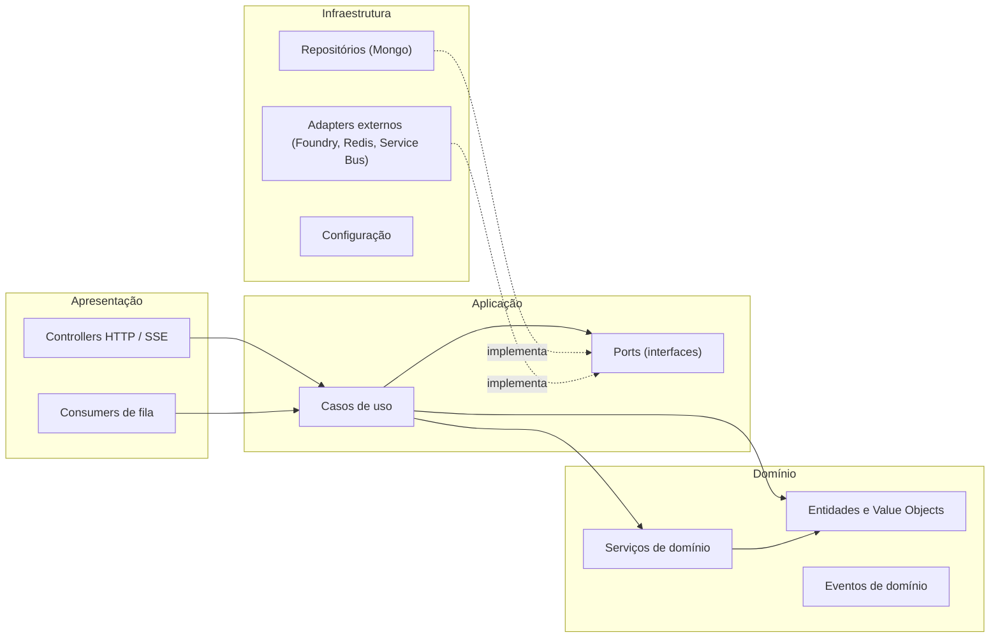

# 03. Guia de implementação do zero

> Como iniciar e conduzir o desenvolvimento da AIA 2.0 a partir de um repositório vazio, com padrões de Engenharia de Software (SOLID, KISS, Clean Code, Clean Architecture), resiliência e escalabilidade incorporados desde o primeiro commit. Assume a arquitetura do documento 02 e as peças de cloud do documento 04.

## 1. Equipe e papéis mínimos

| Papel | Quantidade sugerida | Responsabilidade |
|---|---|---|
| Arquiteto de plataforma | 1 | Dono dos ADRs, contratos e fronteiras |
| Engenheiros backend TypeScript | 2 a 3 | Router, identity, governance, registry, MCP gateway, knowledge |
| Engenheiros backend Python / IA | 2 | Agent runtime, document processing, evaluation, data platform |
| Engenheiro frontend | 1 a 2 | `aia-web` |
| Engenheiro de plataforma (SRE / DevOps) | 1 a 2 | Landing zone, AKS, CI/CD, observabilidade, IaC |
| Segurança de aplicação | 1 (parcial) | Threat modeling, revisão de tools, red team |
| Product owner | 1 | Priorização, casos de uso piloto |
| Compliance / DPO | Parcial | Classificação de dados, evidências BACEN e LGPD |

Times menores começam com a Fase 1 (núcleo) e crescem por plano.

## 2. Organização de repositórios

Um monorepo para o núcleo (ADR-011), com build seletivo por afetados. Produtos em repositórios próprios.

```
aia-platform/
├── apps/
│   ├── web/                        # aia-web (Next.js)
│   ├── inference-router/           # NestJS
│   ├── identity/                   # NestJS
│   ├── governance/                 # NestJS
│   ├── registry/                   # NestJS
│   ├── mcp-gateway/                # NestJS
│   ├── knowledge/                  # NestJS (api + worker)
│   ├── agent-runtime/              # FastAPI
│   ├── document-processing/        # FastAPI (api + worker)
│   ├── evaluation/                 # FastAPI
│   └── data-platform/              # Python jobs
├── packages/                       # TypeScript compartilhado
│   ├── contracts/                  # tipos gerados de OpenAPI e AsyncAPI
│   ├── auth/                       # validação de JWT e claims do APIM, guards
│   ├── resilience/                 # timeout, retry, circuit breaker, bulkhead
│   ├── telemetry/                  # OpenTelemetry bootstrap e atributos aia.*
│   ├── errors/                     # Problem Details e catálogo de erros
│   ├── messaging/                  # cliente Service Bus, outbox, CloudEvents
│   └── sdk/                        # SDK público para produtos
├── python/                         # Python compartilhado (uv workspace)
│   ├── aia_contracts/
│   ├── aia_auth/
│   ├── aia_resilience/
│   ├── aia_telemetry/
│   ├── aia_errors/
│   ├── aia_messaging/
│   └── aia_sdk/
├── contracts/
│   ├── openapi/                    # um arquivo por serviço, versionado
│   └── asyncapi/                   # eventos e filas
├── infra/
│   ├── bicep/ (ou terraform/)      # módulos por peça de cloud
│   ├── k8s/                        # Helm charts por serviço, Kustomize por ambiente
│   └── policies/                   # Azure Policy, admission policies
├── evals/                          # datasets e suítes de avaliação versionadas
├── docs/
│   ├── adr/                        # ADR-001 em diante
│   └── runbooks/
├── tools/                          # geradores de serviço, scripts de dev
├── nx.json / pnpm-workspace.yaml   # TypeScript
├── pyproject.toml                  # uv workspace
└── .github/workflows/ (ou azure-pipelines/)
```

Ferramentas: pnpm + Nx para TypeScript (cache e build por afetados), uv workspaces para Python, Turborepo é alternativa a Nx. Um `Makefile` ou `justfile` na raiz padroniza `make dev`, `make test`, `make lint`, `make eval`.

## 3. Clean Architecture por serviço

### 3.1 Regra de dependência

Dependências apontam para dentro. O domínio não conhece framework, banco, HTTP ou provedor de modelo. A camada de aplicação orquestra casos de uso via ports (interfaces). A infraestrutura implementa os ports. A apresentação (controllers, consumers de fila, CLI) só adapta entrada e saída.



Um teste de arquitetura roda no CI e falha se `domain/` importar de `infrastructure/` ou de qualquer framework (dependency-cruiser para TypeScript, import-linter para Python).

### 3.2 Template NestJS

```
apps/inference-router/src/
├── main.ts                          # bootstrap: telemetry, config, app
├── app.module.ts
├── modules/
│   └── completions/                 # um módulo por caso de uso agregado
│       ├── domain/
│       │   ├── entities/            # ModelAlias, BudgetReservation, InferenceRequest
│       │   ├── value-objects/       # ProjectId, TokenCount, DataClassification
│       │   ├── services/            # ModelSelectionPolicy (regra pura)
│       │   ├── events/              # UsageRecorded
│       │   └── errors/              # BudgetExhaustedError, NoCompatibleDeploymentError
│       ├── application/
│       │   ├── use-cases/           # CreateChatCompletion, CreateEmbeddings
│       │   ├── ports/               # BudgetLedger, ModelProvider, PolicyReader, UsagePublisher
│       │   └── dto/                 # entrada e saída dos casos de uso (sem decorators de HTTP)
│       ├── infrastructure/
│       │   ├── redis/               # RedisBudgetLedger (Lua scripts)
│       │   ├── apim/                # ApimModelProvider (chama o AI Gateway)
│       │   ├── governance/          # HttpPolicyReader com cache
│       │   ├── mongo/               # AuditRepository
│       │   └── messaging/           # OutboxUsagePublisher
│       └── presentation/
│           ├── http/                # CompletionsController (OpenAI-compat), SSE
│           └── mappers/             # DTO HTTP para DTO de aplicação
├── shared/                          # cross-cutting do serviço (não do domínio)
└── config/                          # schema de configuração validado (zod)
```

Exemplo de port e adapter (TypeScript):

```ts
// application/ports/budget-ledger.ts
export interface BudgetLedger {
  reserve(input: { projectId: ProjectId; estimatedTokens: number; aliasId: string }): Promise<Reservation>;
  commit(input: { reservationId: string; actualTokens: number }): Promise<void>;
  release(reservationId: string): Promise<void>;
}
export const BUDGET_LEDGER = Symbol('BudgetLedger');

// application/use-cases/create-chat-completion.ts
@Injectable()
export class CreateChatCompletion {
  constructor(
    @Inject(BUDGET_LEDGER) private readonly ledger: BudgetLedger,
    @Inject(MODEL_PROVIDER) private readonly provider: ModelProvider,
    @Inject(POLICY_READER) private readonly policies: PolicyReader,
    @Inject(USAGE_PUBLISHER) private readonly usage: UsagePublisher,
  ) {}

  async execute(cmd: CreateChatCompletionCommand): Promise<CompletionStream> {
    const policy = await this.policies.forProject(cmd.projectId);
    const deployments = ModelSelectionPolicy.compatible(policy, cmd.alias); // regra pura de domínio
    if (deployments.length === 0) throw new NoCompatibleDeploymentError(cmd.alias, policy.classification);

    const reservation = await this.ledger.reserve({
      projectId: cmd.projectId,
      estimatedTokens: cmd.estimateTokens(),
      aliasId: cmd.alias,
    });

    try {
      const stream = await this.provider.complete(cmd, deployments);
      stream.onFinished(async (u) => {
        await this.ledger.commit({ reservationId: reservation.id, actualTokens: u.totalTokens });
        await this.usage.publish(UsageRecorded.from(cmd, u, reservation));
      });
      return stream;
    } catch (e) {
      await this.ledger.release(reservation.id);
      throw e;
    }
  }
}

// infrastructure/redis/redis-budget-ledger.ts
@Injectable()
export class RedisBudgetLedger implements BudgetLedger {
  constructor(private readonly redis: Redis, private readonly scripts: LuaScripts) {}
  async reserve(input) {
    // script Lua garante atomicidade: verifica saldo, incrementa reservado, retorna id
    const [ok, id] = await this.redis.evalsha(this.scripts.reserve, 1, key(input.projectId), input.estimatedTokens);
    if (!ok) throw new BudgetExhaustedError(input.projectId);
    return { id };
  }
  // commit e release omitidos
}
```

Regras do template:

- Casos de uso recebem comandos e devolvem resultados; nunca recebem `Request` do Express.
- Decorators do NestJS ficam em `presentation/` e `infrastructure/`. `domain/` é TypeScript puro.
- Um módulo NestJS por agregado; módulos não importam `infrastructure/` de outros módulos.
- Configuração validada na inicialização com zod; a aplicação não sobe com configuração inválida.

### 3.3 Template FastAPI

```
apps/agent-runtime/src/agent_runtime/
├── main.py                          # cria a app, registra telemetry e routers
├── domain/
│   ├── entities.py                  # AgentDefinition, Run, Thread, ToolCall
│   ├── value_objects.py             # ProjectId, RiskLevel
│   ├── policies.py                  # ApprovalPolicy (regra pura)
│   └── errors.py
├── application/
│   ├── use_cases/
│   │   ├── start_run.py
│   │   ├── resume_run.py
│   │   └── approve_tool_call.py
│   ├── ports.py                     # Protocols: AgentRepository, Checkpointer, ToolGateway, ModelClient
│   └── dto.py                       # dataclasses ou pydantic sem detalhes de HTTP
├── infrastructure/
│   ├── langgraph/                   # construção do grafo a partir da definição
│   ├── mongo/                       # repositórios e checkpointer
│   ├── mcp/                         # cliente do aia-mcp-gateway
│   ├── router_client/               # cliente do inference router (OpenAI-compat)
│   ├── messaging/                   # outbox e publisher Service Bus
│   └── config.py                    # pydantic-settings
├── presentation/
│   ├── http/                        # routers FastAPI, SSE
│   └── consumers/                   # handlers de fila
└── container.py                     # composição de dependências (wiring)
```

Exemplo de port e caso de uso (Python):

```python
# application/ports.py
from typing import Protocol

class ToolGateway(Protocol):
    async def invoke(self, *, tool_id: str, args: dict, principal: Principal, project_id: ProjectId) -> ToolResult: ...

class Checkpointer(Protocol):
    async def save(self, run_id: str, state: RunState) -> None: ...
    async def load(self, run_id: str) -> RunState | None: ...

# application/use_cases/approve_tool_call.py
class ApproveToolCall:
    def __init__(self, checkpointer: Checkpointer, tools: ToolGateway, graph: GraphRunner):
        self._checkpointer = checkpointer
        self._tools = tools
        self._graph = graph

    async def execute(self, cmd: ApproveToolCallCommand) -> RunEvents:
        state = await self._checkpointer.load(cmd.run_id)
        if state is None or not state.is_waiting_approval(cmd.tool_call_id):
            raise RunNotWaitingApproval(cmd.run_id)
        if not ApprovalPolicy.can_approve(cmd.principal, state.pending_call):
            raise ApprovalForbidden(cmd.principal.id)
        result = await self._tools.invoke(
            tool_id=state.pending_call.tool_id,
            args=state.pending_call.args,
            principal=cmd.principal,
            project_id=state.project_id,
        )
        return self._graph.resume(state, tool_result=result)
```

Regras do template:

- Ports como `Protocol`; adapters não herdam, só cumprem a assinatura (duck typing verificado por mypy).
- Composição em `container.py`, nunca dentro de casos de uso.
- Nada de `Depends()` do FastAPI fora de `presentation/`.
- Pydantic para validação de borda (HTTP, fila, config); entidades de domínio podem ser dataclasses puras.

## 4. Padrões de projeto aplicados

| Padrão | Onde | Motivo |
|---|---|---|
| Ports and Adapters (Hexagonal) | Todos os serviços | Inverte dependências; troca de banco, provedor ou fila sem tocar em casos de uso |
| Strategy | Seleção de deployment no router; estratégia de chunking no knowledge; parser no document processing | Variação de algoritmo isolada em classes intercambiáveis |
| Adapter | Provedores de modelo (OpenAI, Anthropic) atrás da API canônica | Consumidor não vê diferença entre provedores (LSP) |
| Decorator | Resiliência (timeout, retry, circuit breaker) e telemetria em torno de ports | Comportamento transversal sem poluir casos de uso |
| Chain of Responsibility | Pipeline de guardrails no router (classificação, redação, política) | Cada etapa é testável isoladamente e a ordem é configurável |
| Repository | Persistência de agregados | Domínio não conhece Mongo |
| Outbox | Publicação de eventos | Consistência entre estado e evento sem transações distribuídas |
| Saga (coreografia) | Reserva, commit e reconciliação de orçamento | Passos compensáveis sem lock global |
| Circuit Breaker e Bulkhead | Chamadas a Foundry, tools e serviços internos | Contém falhas e evita amplificação |
| Registry | Aliases de modelo, tools, prompts | Resolução por nome com versão e ciclo de vida |
| Specification | Políticas de acesso a modelo e de aprovação de tool | Regras combináveis e testáveis (`and`, `or`, `not`) |
| Factory | Construção do grafo LangGraph a partir da definição do registry | Isola detalhes do framework |
| Anti-Corruption Layer | Integrações com Jira, GitLab, IRH, CSM | Modelos externos não vazam para o domínio |
| CQRS leve | Consumo e FinOps (escrita via eventos, leitura via ADX) | Leituras analíticas não competem com o transacional |

Regra KISS: um padrão só entra quando resolve um problema presente. Nenhum "para quando precisarmos".

## 5. Padrões de código (Clean Code)

- **Nomes**: linguagem ubíqua do domínio (`BudgetReservation`, não `BudgetObj`). Verbos para casos de uso (`CreateChatCompletion`), substantivos para entidades.
- **Funções**: uma responsabilidade, poucas linhas, no máximo três parâmetros (use objetos de comando). Sem flags booleanas que mudam comportamento.
- **Erros**: exceções de domínio tipadas, mapeadas em Problem Details na apresentação com `type`, `title`, `status`, `detail`, `instance`, `trace_id` e um código estável (`budget_exhausted`). Nunca engolir exceção; nunca retornar `null` para indicar erro.
- **Sem comentários explicando o quê**: código expressa o quê; comentário explica o porquê quando não é óbvio.
- **Imutabilidade por padrão**: value objects imutáveis; entidades mudam por métodos com nome de negócio.
- **Configuração**: 12-factor, variáveis de ambiente validadas por schema, segredos só via Key Vault (nunca em `.env` commitado).
- **Logs**: estruturados (JSON), sem PII, com `trace_id`, `project_id` e `principal_id`. Nível `info` para eventos de negócio, `warn` para degradação, `error` para falhas com stack.
- **Linters e formatadores**: ESLint com `typescript-eslint` estrito e Prettier; Ruff (lint e format) e mypy `--strict` em Python. Build falha em warning de lint.
- **Revisão**: toda PR precisa de um revisor de outro serviço e passa pelos checks automáticos (lint, testes, arquitetura, segurança, evals quando aplicável).
- **Commits**: Conventional Commits; changelog gerado.

## 6. Contratos

- **OpenAPI 3.1 contract-first**: o arquivo em `contracts/openapi/<service>.yaml` é a fonte; tipos e clientes são gerados (`openapi-typescript`, `openapi-python-client`). O serviço valida requests contra o contrato em runtime (middleware) no ambiente de dev e homologação.
- **API canônica de inferência**: compatível com OpenAI (`/v1/chat/completions`, `/v1/embeddings`, `/v1/images/generations`, `/v1/audio/transcriptions`). Provedores não-OpenAI são traduzidos no adapter. O consumidor nunca escolhe provedor, só alias.
- **AsyncAPI** para eventos: envelope CloudEvents 1.0 com `type` (por exemplo `aia.inference.usage.recorded.v1`), `source`, `subject` (`project_id`), `time`, `traceparent` em extensão. Payload versionado; mudanças incompatíveis geram novo `type`.
- **Versionamento**: caminho (`/v1`) para REST; sufixo `.v1` no tipo do evento. Depreciação com header `Deprecation` e prazo mínimo de 90 dias.
- **Paginação**: cursor opaco em todas as listas.
- **Idempotência**: `Idempotency-Key` obrigatório em POST não-streaming que cria recursos ou consome orçamento.
- **SSE**: `Content-Type: text/event-stream`, eventos nomeados, `id` incremental para reconexão, heartbeat a cada 15 s.

## 7. Estratégia de testes

| Nível | Escopo | Ferramentas | Meta |
|---|---|---|---|
| Unitário de domínio | Entidades, value objects, políticas | Vitest / pytest | Rápido, sem I/O, cobre regras de negócio |
| Unitário de aplicação | Casos de uso com ports falsos (fakes, não mocks frágeis) | Vitest / pytest | Cada caminho de erro tem teste |
| Arquitetura | Regra de dependência | dependency-cruiser / import-linter | Falha o build |
| Contrato | Provedor cumpre OpenAPI; consumidor e provedor de eventos compatíveis | Schemathesis, Pact (ou testes de compatibilidade de schema AsyncAPI) | Roda em toda PR |
| Integração | Adapters contra dependências reais em container | Testcontainers (Mongo, Redis, emulador de Service Bus), Azurite (Blob) | Roda em toda PR do serviço afetado |
| Ponta a ponta | Fluxos 7.1 a 7.3 do documento 02 em ambiente de dev | Playwright (web), scripts de API | Roda no merge para `main` |
| Avaliação (evals) | Qualidade e segurança de prompts, agentes e RAG | `aia-evaluation`, datasets em `evals/` | Gate por limiar; roda quando prompt, agente, chunking ou alias muda |
| Red team | Injeção de prompt, jailbreak, exfiltração via tool | Suíte adversarial em `evals/redteam/` | Semanal e antes de release |
| Carga | Router e knowledge sob concorrência por projeto | k6 | Antes de cada release maior |
| Caos | Falha de região do Foundry, Redis indisponível, fila cheia | Azure Chaos Studio | Trimestral |

Mocks de modelo: em testes unitários e de integração, o `ModelProvider` é um fake determinístico. Chamadas reais a modelo só em evals, com orçamento próprio e projeto `platform-ci`.

## 8. CI/CD

Pipeline por serviço afetado (Nx affected / uv), em GitHub Actions ou Azure Pipelines:

1. **Lint e tipos**: ESLint, Prettier, Ruff, mypy.
2. **Testes**: unitários, arquitetura, contrato, integração (Testcontainers).
3. **Segurança estática**: SAST (CodeQL ou Semgrep), scan de segredos (gitleaks), scan de dependências (Dependabot / Renovate + osv-scanner).
4. **Build**: imagem distroless multi-stage, tag imutável por digest.
5. **SBOM e assinatura**: Syft gera SBOM, Cosign assina imagem e SBOM, Trivy varre a imagem. Admission controller no AKS só aceita imagens assinadas do ACR.
6. **Evals** (quando aplicável): `aia-evaluation` executa a suíte do serviço; falha abaixo do limiar bloqueia.
7. **Deploy dev**: Helm via GitOps (Argo CD ou Flux) a partir de `infra/k8s`, promoção por PR no repositório de ambientes.
8. **Testes ponta a ponta em dev**.
9. **Promoção para homologação**: aprovação manual do dono do serviço; smoke tests.
10. **Promoção para produção**: janela definida, canário por projeto (feature flag em Azure App Configuration), rollback automático por SLO (taxa de erro e tempo até o primeiro token).

Infraestrutura segue o mesmo fluxo: PR em `infra/`, `what-if` (Bicep) ou `plan` (Terraform) comentado na PR, aprovação, `apply` por ambiente.

## 9. Infraestrutura como código

- Bicep com Azure Verified Modules (ou Terraform com módulos equivalentes). Um módulo por peça do documento 04.
- Três subscriptions (dev, homologação, produção) sob a landing zone do banco; hub-spoke com o spoke da plataforma; seis zonas de DNS privado criadas antes do primeiro deploy (causa mais comum de falha em deploy de Foundry com private endpoint).
- Ordem de provisionamento: rede e DNS, identidade e Key Vault, observabilidade (Log Analytics, App Insights, Grafana), ACR, dados (Cosmos DB, Redis, Service Bus, Blob, AI Search, ADX), Foundry e deployments, APIM, AKS e Container Apps, políticas.
- Tudo com tags obrigatórias (`owner`, `cost-center`, `data-classification`, `environment`) validadas por Azure Policy.

## 10. Roadmap por fases

Cada fase tem entregáveis, Definition of Done e critério de saída. Durações são estimativas para o time da seção 1.

### Fase 0: Fundações (3 a 4 semanas)

Entregáveis: landing zone e spoke da plataforma; AKS privado; APIM interno; Key Vault; observabilidade (collector, Azure Monitor, Grafana); ACR com assinatura; monorepo com geradores de serviço (`tools/`), bibliotecas compartilhadas (`auth`, `resilience`, `telemetry`, `errors`, `messaging`) em TypeScript e Python; pipeline CI/CD completo rodando com um serviço "hello" em cada linguagem; ADR-001 a ADR-011 aprovados.

DoD: um commit em `main` chega em dev sem intervenção manual, com SBOM, assinatura e trace visível no Grafana.

Critério de saída: revisão de segurança da landing zone e inventário inicial de fluxos de dados entregue ao compliance.

### Fase 1: Núcleo de inferência (4 a 6 semanas)

Entregáveis: `aia-identity` (JWT local, PAT, papéis); `aia-governance` (projetos, orçamento, classificação, políticas de modelo); AI Gateway no APIM (token limit, content safety, load balancer, circuit breaker); `aia-inference-router` (API canônica, aliasing, reserva e commit, auditoria, `UsageRecorded`); `aia-data-platform` Bronze e Silver para uso e custo; `aia-web` com módulo de chat e módulo admin básico (projetos, orçamento).

DoD: um usuário do Entra cria um projeto, recebe orçamento, conversa com dois aliases (um OpenAI, um Anthropic) via SSE, e vê o consumo no dia seguinte. Fluxo 7.1 coberto por teste ponta a ponta. SLOs do router com dashboards e alertas.

Critério de saída: piloto com dois times internos por duas semanas; revisão de segurança do router (OWASP LLM01, LLM02, LLM10).

### Fase 2: Conhecimento e catálogo (4 a 6 semanas)

Entregáveis: `aia-registry` (ativos e diretório, prompts versionados); `aia-document-processing` (parsers e jobs); `aia-knowledge` (stores, ingestão assíncrona, busca híbrida, security trimming, MCP server); conector de wiki corporativa; módulo de conhecimento e biblioteca de prompts no `aia-web`; `aia-evaluation` mínimo (datasets, groundedness, relevância, gate no CI).

DoD: fluxo 7.3 ponta a ponta; busca respeita ACL por documento em teste automatizado; eval de RAG roda no CI e bloqueia regressão de groundedness.

Critério de saída: um caso de uso de RAG em produção com avaliação online ativa.

### Fase 3: Agentes e tools (6 a 8 semanas)

Entregáveis: `aia-mcp-gateway` (allow-list, identidade por chamada, risco, auditoria); `aia-agent-runtime` (LangGraph, checkpoints, HITL, SSE); tools iniciais (busca em knowledge, GitLab leitura, Jira leitura, code interpreter em Dynamic Sessions); módulo de agentes no `aia-web`; evals de agente; red team inicial.

DoD: fluxo 7.2 ponta a ponta com aprovação humana; tool de risco alto não executa sem aprovação em teste automatizado; toda invocação de tool auditada em ADX com identidade e projeto.

Critério de saída: threat model de agentes revisado pela segurança; um agente interno em produção.

### Fase 4: Produtos e FinOps (4 a 6 semanas)

Entregáveis: SDK público (`@aia/sdk`, `aia_sdk`) com exemplos; migração do CodeGuardian para consumir a plataforma; Gold no ADX (custo por projeto, alias, usuário, produto); módulo FinOps no `aia-web`; showback mensal; alertas de orçamento; ciclo de vida de modelos (datas de descontinuação, suíte de regressão, canário).

DoD: CodeGuardian roda sem chamar Foundry diretamente; relatório de showback gerado automaticamente; troca de deployment de um alias passa pela suíte de regressão.

### Fase 5: Endurecimento e conformidade (contínuo, primeiro ciclo em 4 semanas)

Entregáveis: DR ativo-passivo testado; Chaos Studio; retenção e direitos do titular (LGPD) implementados; evidências BACEN 4.893 (inventário, contratos, testes); auditoria interna; revisão dos ADRs.

DoD: teste de DR com RTO e RPO medidos; relatório de evidências aceito pelo compliance.

## 11. Checklist do dia 1 (Sprint 0)

- [ ] Nome do produto, domínio interno e naming convention (`aia-<serviço>`, `snet-<função>`, `kv-aia-<env>`).
- [ ] Subscriptions dev, hml, prod criadas e ligadas à landing zone.
- [ ] Grupos do Entra ID para papéis de plataforma criados.
- [ ] Monorepo criado com estrutura da seção 2, `CODEOWNERS`, templates de PR e ADR.
- [ ] Geradores de serviço (NestJS e FastAPI) produzindo o esqueleto da seção 3.
- [ ] Bibliotecas compartilhadas com testes e publicação interna.
- [ ] Contratos OpenAPI iniciais do router, identity e governance.
- [ ] Pipeline CI/CD com todos os estágios da seção 8 (mesmo que alguns rodem vazios).
- [ ] Dashboard "plataforma" no Grafana com os SLOs da seção 11 do documento 02.
- [ ] Projeto `platform-ci` com orçamento próprio para evals.
- [ ] Reunião inicial com compliance e DPO: classificação de dados, regiões, retenção.

## 12. Runbooks essenciais

Cada runbook vive em `docs/runbooks/` e é testado em game day.

| Runbook | Gatilho | Passos resumidos |
|---|---|---|
| Foundry degradado em uma região | Alerta de circuit breaker aberto por mais de 5 min | Confirmar no status do Azure; verificar que o balanceador redirecionou; se ambas as regiões falham, ativar alias de contingência; comunicar projetos afetados |
| Redis indisponível | Alerta de saúde | Router entra em modo `budget_unverified`; escalar Redis ou failover; ao voltar, executar reconciliação forçada |
| Fila de ingestão acima do limite | Alerta de comprimento | Verificar workers e KEDA; verificar erros no dead-letter; se for limite de embeddings, reduzir lote e reenfileirar |
| Descontinuação de modelo anunciada | Alerta 60 dias antes | Registrar candidato; rodar suíte de regressão; canário em projetos voluntários; trocar deployment do alias; comunicar |
| Suspeita de injeção de prompt ou exfiltração | Alerta do Content Safety ou do Sentinel | Congelar tool ou projeto; coletar trace completo; revisar prompts e documentos recuperados; abrir incidente de segurança |
| Rotação de segredo comprometido | Detecção | Rotacionar no Key Vault; reiniciar pods afetados; revogar PATs do projeto se aplicável |
| Pedido de titular (LGPD) | Solicitação do DPO | Executar busca por identificador; exportar ou apagar; registrar evidência |
| Teste de DR | Trimestral | Failover controlado; medir RTO e RPO; registrar |

## 13. Checklist de prontidão para produção (por serviço)

- [ ] Contrato OpenAPI ou AsyncAPI publicado e validado em runtime.
- [ ] Testes unitários, de arquitetura, de contrato e de integração passando; cobertura de domínio e aplicação acima de 80 %.
- [ ] Evals com limiar definido (quando o serviço usa modelo).
- [ ] Telemetria: traces com `aia.project_id`, métricas de SLI, logs estruturados sem PII.
- [ ] Dashboard e alertas de SLO.
- [ ] Políticas de resiliência declaradas (tabela da seção 8 do documento 02).
- [ ] Health checks de liveness e readiness; graceful shutdown; limites de CPU e memória; HPA ou KEDA.
- [ ] Sem segredos em variáveis; Managed Identity configurada; private endpoints.
- [ ] Imagem assinada, SBOM publicado, sem vulnerabilidades críticas abertas.
- [ ] Runbook do serviço escrito e dono definido (on-call).
- [ ] Threat model revisado; tools classificadas por risco (quando aplicável).
- [ ] Classificação de dados e retenção configuradas; fluxos de dados no inventário do compliance.
- [ ] ADRs atualizados.
