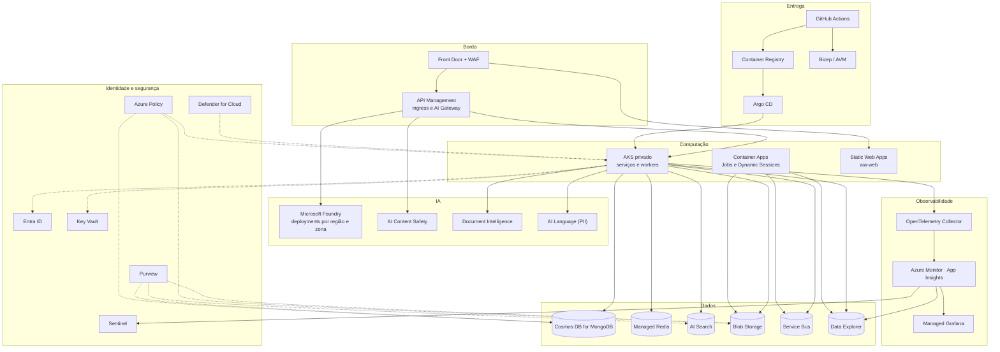

# 04. Peças de cloud: Azure como primária, com equivalentes em AWS e GCP

> Catálogo dos serviços de nuvem necessários para implementar a AIA 2.0. Cada linha traz o serviço Azure escolhido, o papel na plataforma, a fase do roadmap (documento 03) em que entra, e os equivalentes funcionais em AWS e GCP. "Equivalente" significa a peça que cumpre o mesmo papel arquitetural, não paridade de funcionalidades. Verifique disponibilidade por região e por modelo antes de contratar; o cenário muda com frequência.

## 1. Como ler

- **Fase**: 0 (fundações), 1 (núcleo de inferência), 2 (conhecimento), 3 (agentes), 4 (produtos e FinOps), 5 (endurecimento).
- **Obrigatório**: sem essa peça a arquitetura do documento 02 não funciona como desenhada. **Recomendado**: pode ser substituído por alternativa open source ou já existente no banco.
- Notas regulatórias referem-se à Resolução CMN 4.893/2021 e à LGPD; não substituem análise jurídica.

## 2. Rede e borda

| Papel | Azure | AWS | GCP | Fase | Status |
|---|---|---|---|---|---|
| Rede privada hub-spoke | Virtual Network, VNet peering, Network Security Groups | VPC, Transit Gateway, Security Groups e NACLs | VPC, Shared VPC, Network Connectivity Center, firewall rules | 0 | Obrigatório |
| Conectividade com data center | ExpressRoute (ou VPN Gateway) | Direct Connect (ou Site-to-Site VPN) | Cloud Interconnect (ou Cloud VPN) | 0 | Obrigatório em banco |
| Firewall de saída com allow-list | Azure Firewall (Premium para TLS inspection) | AWS Network Firewall | Cloud Next Generation Firewall | 0 | Obrigatório |
| Acesso privado a PaaS | Private Link e Private Endpoints, Private DNS Zones | AWS PrivateLink, VPC endpoints, Route 53 private hosted zones | Private Service Connect, Cloud DNS private zones | 0 | Obrigatório |
| Ingress web com WAF e CDN | Azure Front Door Premium com WAF (ou Application Gateway com WAF v2 para ingress só interno) | CloudFront com AWS WAF (ou ALB com WAF) | Cloud Load Balancing global com Cloud Armor | 0 | Obrigatório |
| Proteção DDoS | Azure DDoS Network Protection | AWS Shield Advanced | Cloud Armor (Advanced) | 0 | Recomendado |
| Acesso administrativo | Azure Bastion | Systems Manager Session Manager | IAP TCP forwarding | 0 | Obrigatório |

## 3. Gateway de API e AI Gateway

| Papel | Azure | AWS | GCP | Fase | Status |
|---|---|---|---|---|---|
| Ingress único de APIs (JWT, rate limit, roteamento) | API Management (tier Premium ou v2 com VNet) | Amazon API Gateway (REST ou HTTP) ou Kong / Apigee em EKS | Apigee (ou Cloud Endpoints para casos simples) | 1 | Obrigatório |
| AI Gateway (token limit, content safety, load balancer com circuit breaker, cache semântico, logs de LLM) | API Management, políticas GenAI (`llm-token-limit`, `llm-content-safety`, `llm-semantic-cache-*`, backend pools) | Sem equivalente nativo completo; combinar API Gateway com Bedrock Guardrails e um gateway de LLM (Kong AI Gateway, LiteLLM, Portkey) | Apigee com políticas para LLM (cache semântico, contagem de tokens) e Model Armor para inspeção; ou gateway de LLM em GKE | 1 | Obrigatório (ou equivalente open source) |
| Gateway de MCP (tools) | `aia-mcp-gateway` próprio; API Management também mediá MCP e A2A com políticas | Próprio ou gateway de MCP de mercado; Bedrock AgentCore Gateway | Próprio ou gateway de MCP de mercado | 3 | Obrigatório (próprio) |

## 4. Modelos e serviços de IA

| Papel | Azure | AWS | GCP | Fase | Status |
|---|---|---|---|---|---|
| Modelos de linguagem, embeddings, imagens, áudio | Microsoft Foundry (Azure OpenAI e outros provedores, incluindo Anthropic no catálogo) | Amazon Bedrock (Anthropic, Amazon Nova, Meta, entre outros) | Vertex AI (Gemini, Model Garden com Anthropic e outros) | 1 | Obrigatório |
| Capacidade reservada para carga base | Provisioned Throughput Units (PTU) | Bedrock Provisioned Throughput | Vertex AI Provisioned Throughput | 4 | Recomendado |
| Filtro de conteúdo e defesa contra injeção | Azure AI Content Safety (Prompt Shields, filtros de categoria, detecção de groundedness) | Amazon Bedrock Guardrails | Model Armor (e filtros de segurança do Vertex AI) | 1 | Obrigatório |
| Extração de documentos (OCR, layout, tabelas) | Azure Document Intelligence | Amazon Textract | Document AI | 2 | Obrigatório |
| Transcrição de áudio | Azure Speech (ou Whisper via Foundry) | Amazon Transcribe | Speech-to-Text | 2 | Recomendado |
| Detecção e redação de PII | Azure AI Language (PII) ou Presidio (open source, Microsoft) | Amazon Comprehend (PII) | Sensitive Data Protection (Cloud DLP) | 1 | Obrigatório (LGPD) |
| Avaliação de qualidade e segurança de respostas | Foundry Evaluation (avaliadores built-in e SDK) complementando o `aia-evaluation` | Bedrock Model Evaluation | Vertex AI Gen AI Evaluation Service | 2 | Recomendado |
| Sandbox para code interpreter | Azure Container Apps Dynamic Sessions | Amazon Bedrock AgentCore Code Interpreter (ou containers efêmeros em Fargate) | Sandbox próprio em Cloud Run Jobs ou GKE (gVisor) | 3 | Obrigatório para a tool de código |

## 5. Computação

| Papel | Azure | AWS | GCP | Fase | Status |
|---|---|---|---|---|---|
| Orquestração de containers (serviços HTTP e workers) | Azure Kubernetes Service (cluster privado, node pools por plano, KEDA, Workload Identity) | Amazon EKS (Pod Identity, KEDA) | GKE (Autopilot ou Standard, Workload Identity Federation) | 0 | Obrigatório |
| Jobs agendados e batch (data platform) | Azure Container Apps Jobs (ou Azure Functions com timer, ou AKS CronJob com lock) | AWS Batch ou ECS scheduled tasks, EventBridge Scheduler com Lambda | Cloud Run Jobs com Cloud Scheduler | 1 | Obrigatório |
| Hospedagem do frontend | Azure Static Web Apps ou App Service (atrás do Front Door) | Amplify Hosting ou S3 com CloudFront | Firebase Hosting ou Cloud Run | 1 | Obrigatório |
| Registro de imagens | Azure Container Registry (Premium, private endpoint, assinatura com Cosign) | Amazon ECR | Artifact Registry | 0 | Obrigatório |

## 6. Dados

| Papel | Azure | AWS | GCP | Fase | Status |
|---|---|---|---|---|---|
| Banco de documentos (API MongoDB) | Azure Cosmos DB for MongoDB (vCore) ou MongoDB Atlas na Azure | Amazon DocumentDB (compatível com MongoDB) ou MongoDB Atlas | Firestore com compatibilidade MongoDB ou MongoDB Atlas | 1 | Obrigatório |
| Cache, contadores atômicos, sessões | Azure Managed Redis (ou Azure Cache for Redis Enterprise) | Amazon ElastiCache (Redis ou Valkey) | Memorystore for Redis | 1 | Obrigatório |
| Índice vetorial e busca híbrida | Azure AI Search (vetorial, híbrida, reranker semântico, filtros de segurança) | Amazon OpenSearch Service (k-NN) ou Bedrock Knowledge Bases | Vertex AI Search ou Vertex AI Vector Search | 2 | Obrigatório |
| Armazenamento de objetos | Azure Blob Storage (hierarchical namespace opcional, GRS, private endpoint, SAS de curta duração) | Amazon S3 | Cloud Storage | 1 | Obrigatório |
| Mensageria de eventos e filas | Azure Service Bus (Premium para private endpoint; tópicos, filas, sessões, dead-letter) | Amazon SQS e SNS (ou Amazon MQ) | Pub/Sub | 1 | Obrigatório |
| Eventos de plataforma (integração com Azure) | Azure Event Grid | Amazon EventBridge | Eventarc | 2 | Recomendado |
| Streaming de alto volume (telemetria bruta, se necessário) | Azure Event Hubs | Amazon Kinesis Data Streams ou MSK | Pub/Sub ou Managed Service for Apache Kafka | 5 | Opcional |
| Analítico de uso, custo e auditoria | Azure Data Explorer (Kusto) | Amazon Redshift Serverless (ou OpenSearch para logs) | BigQuery | 1 | Obrigatório |
| Lakehouse e pipelines de dados (se o banco padronizar) | Microsoft Fabric ou Azure Databricks | Databricks ou EMR com Glue | Dataproc ou Databricks | 4 | Opcional |
| Orquestração de ETL gerenciada (alternativa aos jobs próprios) | Azure Data Factory | AWS Glue e Step Functions | Cloud Data Fusion ou Cloud Composer | 4 | Opcional |

## 7. Identidade, segredos e governança

| Papel | Azure | AWS | GCP | Fase | Status |
|---|---|---|---|---|---|
| Identidade de pessoas e aplicações | Microsoft Entra ID (OIDC, grupos, app registrations, Conditional Access) | IAM Identity Center para pessoas; Cognito para aplicações; IAM para serviços | Cloud Identity (Workspace) e Identity Platform | 0 | Obrigatório |
| Identidade de workloads sem segredo | Managed Identity e Workload Identity no AKS | IAM Roles com EKS Pod Identity ou IRSA | Workload Identity Federation for GKE | 0 | Obrigatório |
| Segredos e chaves | Azure Key Vault (ou Managed HSM para chaves regulatórias) | AWS Secrets Manager e AWS KMS (CloudHSM se exigido) | Secret Manager e Cloud KMS (Cloud HSM) | 0 | Obrigatório |
| Configuração e feature flags | Azure App Configuration | AWS AppConfig | Sem nativo direto; usar Firebase Remote Config ou ferramenta de terceiros | 1 | Recomendado |
| Políticas de conformidade de recursos | Azure Policy | AWS Config e Service Control Policies | Organization Policy Service | 0 | Obrigatório |
| Catálogo e classificação de dados | Microsoft Purview | Amazon DataZone com Macie | Dataplex com Sensitive Data Protection | 2 | Recomendado |
| Postura de segurança | Microsoft Defender for Cloud (Containers, Storage, Key Vault) | AWS Security Hub, GuardDuty, Inspector | Security Command Center | 0 | Obrigatório |
| SIEM | Microsoft Sentinel | Amazon Security Lake com SIEM parceiro (ou OpenSearch) | Google Security Operations | 1 | Obrigatório em banco |

## 8. Observabilidade

| Papel | Azure | AWS | GCP | Fase | Status |
|---|---|---|---|---|---|
| Coleta padronizada | OpenTelemetry Collector (em AKS), convenções `gen_ai.*` | Idem (AWS Distro for OpenTelemetry) | Idem (Google Cloud Ops Agent ou collector) | 0 | Obrigatório |
| Logs, métricas e traces | Azure Monitor: Log Analytics, Application Insights | CloudWatch Logs e Metrics, AWS X-Ray | Cloud Logging, Cloud Monitoring, Cloud Trace | 0 | Obrigatório |
| Dashboards e SLOs | Azure Managed Grafana (ou Workbooks) | Amazon Managed Grafana | Cloud Monitoring dashboards (ou Grafana em GKE) | 0 | Obrigatório |
| Teste de carga | Azure Load Testing (ou k6 em AKS) | k6 em EKS (ou Distributed Load Testing) | k6 em GKE | 4 | Recomendado |
| Engenharia do caos | Azure Chaos Studio | AWS Fault Injection Service | Chaos Mesh ou LitmusChaos em GKE | 5 | Recomendado |

## 9. Entrega e operação

| Papel | Azure | AWS | GCP | Fase | Status |
|---|---|---|---|---|---|
| Repositórios e CI/CD | GitHub (Enterprise) com Actions ou Azure DevOps Pipelines | GitHub ou CodePipeline com CodeBuild | GitHub ou Cloud Build | 0 | Obrigatório |
| Infraestrutura como código | Bicep com Azure Verified Modules (ou Terraform) | CloudFormation ou CDK (ou Terraform) | Infrastructure Manager (Terraform) | 0 | Obrigatório |
| GitOps para Kubernetes | Argo CD ou Flux (extensão do AKS) | Argo CD ou Flux | Config Sync ou Argo CD | 0 | Recomendado |
| Assinatura e SBOM | Cosign, Syft, Trivy; Defender for Containers | Idem; ECR scanning | Idem; Artifact Analysis e Binary Authorization | 0 | Obrigatório |
| Backup e replicação | Azure Backup; Cosmos DB multi-região; Blob GRS; AI Search reconstruível a partir do Blob | AWS Backup; DocumentDB global clusters; S3 CRR | Backup and DR Service; buckets dual-region | 5 | Obrigatório |

## 10. Mapa das peças na topologia

## 11. Residência de dados e zonas de modelo

- **Região primária de dados**: Brazil South (São Paulo) para Cosmos DB, Redis, Blob, AI Search, Service Bus, ADX e Key Vault. Região secundária para DR: definir com o compliance (Brazil Southeast, se disponível para os serviços usados, ou uma região aprovada).
- **Modelos**: a disponibilidade de cada modelo varia por região. Antes de fixar um alias, verifique se o deployment existe em Brazil South. Quando não existir, as opções são deployments em outra região (por exemplo, East US e East US 2, como na AIA) ou deployments de zona de dados. Em qualquer caso fora do Brasil, o fluxo precisa constar do inventário para a comunicação ao BACEN (artigos 15 e 16 da Resolução 4.893) e da avaliação de transferência internacional da LGPD.
- **Roteamento por classificação (ADR-010)**: cada deployment recebe a etiqueta da zona de dados; cada projeto recebe a classificação; o router só combina os compatíveis. Assim a evidência de residência é gerada automaticamente pela auditoria.
- **Retenção de dados no provedor de modelo**: confirmar contratualmente as políticas de retenção e de não uso para treinamento (abuse monitoring e opções de opt-out) e registrar no inventário.

## 12. Dimensionamento inicial (T-shirt)

Ponto de partida para o piloto (Fases 1 e 2, até 500 usuários ativos). Ajustar com os dados do ADX após o primeiro mês.

| Peça | Tamanho inicial | Observação |
|---|---|---|
| AKS | 1 cluster por ambiente; produção com 3 zonas; 2 node pools (sistema, aplicação); 3 a 6 nós D4s v5 no pool de aplicação | Workers escalam por KEDA; reservar pool separado se houver GPU futura |
| API Management | Premium v2 (ou Standard v2 com VNet) 1 unidade em produção | AI Gateway usa cache externo Redis com RediSearch para cache semântico |
| Cosmos DB for MongoDB vCore | M40 com alta disponibilidade em produção; M30 em hml | Um database por serviço no mesmo cluster no início |
| Managed Redis | Balanced 5 GB com zona redundante | Cache semântico do APIM pode usar instância separada |
| AI Search | Standard S1, 1 réplica e 1 partição por ambiente; 2 réplicas em produção | Reranker semântico habilitado |
| Service Bus | Premium 1 unidade em produção (private endpoint); Standard em dev | |
| Blob | Hot para documentos ativos; Cool após 90 dias; GRS em produção | Lifecycle policy por store |
| ADX | Dev/test SKU em dev; 2 nós de produção pequenos com autoscale | Retenção quente 90 dias, fria conforme política |
| Foundry | Deployments pay-as-you-go para o piloto; PTU após medir carga base | Pelo menos dois deployments por alias para fallback |
| Container Apps | Ambiente com Dynamic Sessions (pool de 10 sessões) e Jobs para a data platform | |
| Log Analytics | 30 dias de retenção interativa; export para ADX para longo prazo | Amostragem de traces em produção se o volume subir |

## 13. Peças que não entram (decisão explícita)

- CMS próprio para documentação: substituído por conector de wiki (documento 01, achado 3.12).
- Segundo runtime de agentes: rejeitado por KISS (ADR-005).
- Kafka como barramento de negócio: rejeitado para o volume esperado (ADR-008).
- Chaves de API estáticas para Foundry: proibidas; só Managed Identity via APIM.
- IPs públicos em qualquer backend: proibidos.
